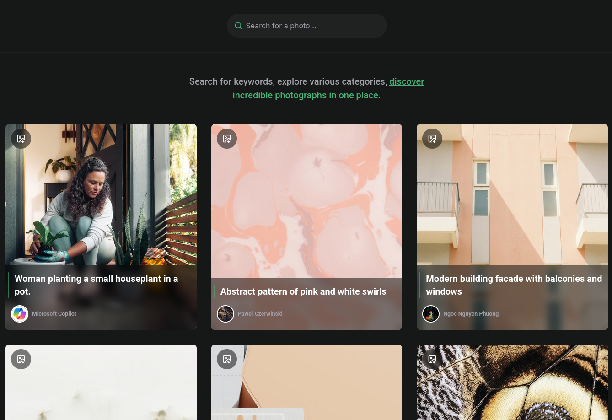

<p align="center">
  
  <br>  
  Picsearch
  <br>
  <a href="https://www.linkedin.com/in/paulopbi/" target="_blank">Linkedin</a> • 
  <a href="https://github.com/paulopbi/" target="_blank">Github</a> •  
  <a href="https://picsearch.vercel.app/" target="_blank">Demo</a> • 
  <a href="https://github.com/paulopbi/picsearch" target="_blank">Repository</a>
</p>

<br/>

**Discover** stunning high-quality photos effortlessly, **Picsearch** is crafted from scratch to **ignite** your creativity, **search** for any image you want and **download** it with just a few clicks!

This project uses the public [Unsplash API](https://unsplash.com/docs).

## Demo



> Demo screenshot

## Features

- **Unsplash API**: All images are from the [Unsplash API](https://unsplash.com/documentation).
- **API Authentication**: Uses Authorization header for API calls.
- **Debounce on search**: Prevents the user from spamming the search input.
- **Search Input**: Search for any image you want and get instant results.
- **Download Images**: Download any image with just a click.
- **Pagination**: Load and navigate through images seamlessly.
- **Cache System**: Uses Tanstack Query for data caching, preventing unnecessary API calls.
- **Lazy Loading**: Images have the `loading="lazy"` attribute.
- **Disabled Buttons**: Prevents the user from spamming the buttons, which avoids unnecessary API calls.
- **Loading and Error handler**: Handles loading and errors from external API calls.
- **Glass Effect**: Creates a modern and visually appealing interface.
- **Neon Effect**: With css `box-shadow` it create a neon lighting effect on `hover`.
- **Typeguards with Typescript**: Ensures type safety between components.
- **Fully Responsive**: Works flawlessly on all screen sizes, from mobile to desktop.
- **Context API**: Uses React Context for sharing global state between components.

### Technologies Used

- **Tanstack Query**: For data fetching and state management.
- **React**: UI library for building user interfaces.
- **TypeScript**: For static typing.
- **Vite**: Build tool and development server.
- **CSS**: Styling for responsive design.
- **Lucide React**: For beautiful icons.
- **PNPM**: Package manager.
- **Biome**: Linting and formatting.

## How to Run

To run this project locally, follow these steps:

1. Clone the repository

```bash
# clone the repository
git clone https://github.com/paulopbi/picsearch
```

2. Configure the `.env` file in the root of the project:

```bash
# add your API key from Unsplash API  
VITE_API_KEY=<YOUR_API_KEY>
# Unsplash API Endpoint
VITE_BASE_URL=https://api.unsplash.com
```

> [!NOTE]
> You can access the `.env.example` file to see the variables that need to be configured.

3. Install dependencies:

I'm currently using `pnpm`, but you can use `npm` if you prefer. 

```bash
# will install all dependencies in the project
pnpm install
```

4. Start the development server:

```bash
# will start the server at http://localhost:5173/
pnpm dev
```

## License

This project uses the **MIT License**, read the [License File](./LICENSE) for more information.
